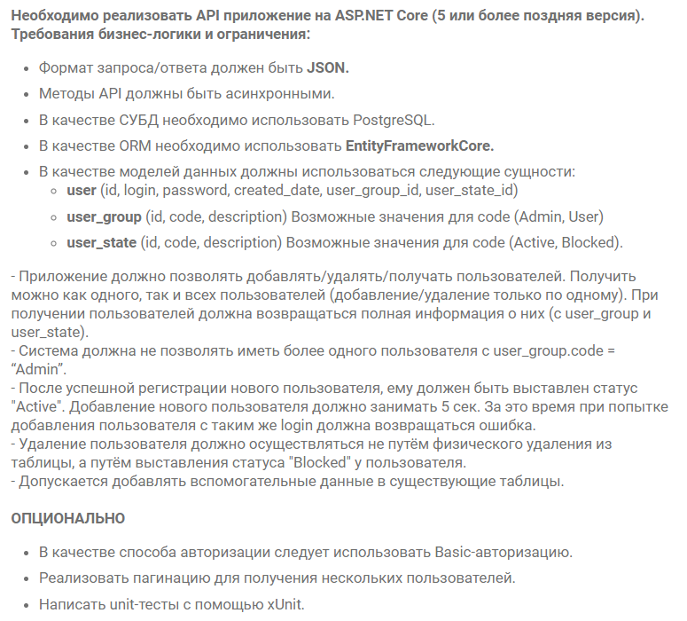

<p>
    <h1 align="center">UserApiTestTaskVk</h1>
</p>

<p align="center">
    Web API для тестового задания на ASP.NET 6
</p>

<p align="center">
  
  
  
  
  
  
  
</p>

<div align="center">
    <a href="https://github.com/Skye7012/UserApiTestTaskVk/issues">
        
    </a>
    <a href="https://github.com/Skye7012/UserApiTestTaskVk/issues?q=is%3Aissue+is%3Aclosed">
        
    </a>
</div>


# Table Of Contents

- [Table Of Contents](#table-of-contents)
- [ТЗ](#тз)
- [Общее описание](#общее-описание)
- [Уточнения по реализации основных требований:](#уточнения-по-реализации-основных-требований)
    - [Поле `user_password` сущности `user`](#поле-user_password-сущности-user)
    - [Ограничение на одного администратора](#ограничение-на-одного-администратора)
    - [Lock in SignUp](#lock-in-signup)
    - [SoftDelete, Metadata](#softdelete-metadata)
    - [Controllers](#controllers)
    - [Авторизация](#авторизация)
- [Уточнения по реализации опциональных требований:](#уточнения-по-реализации-опциональных-требований)
    - [Авторизация](#авторизация-1)
    - [Пагинация](#пагинация)
    - [Unit-тесты](#unit-тесты)
- [Локальный запуск](#локальный-запуск)
    - [Учетные данные пользователя-администратора:](#учетные-данные-пользователя-администратора)


# ТЗ



# Общее описание
Реализован API на ASP.NET 6  
Реализованы основные и опциональные требования с уточнениями в реализации, описанными ниже  

Реализована поддержка docker-compose [(см. "Локальный запуск")](#локальный-запуск)  

API задокументирован с помощью `Swagger`  
Проект структурирован по принципам `clean architecture`  
Используется `CQRS` через [`MediatR`](https://github.com/jbogard/MediatR)  
В качестве ORM используется `Entity Framework Core`, в качестве СУБД `PostgreSql`  
Аутентификация реализована через [`JWT`](https://jwt.io/) токены  
  
Написаны модульные тесты с помощью `xUnit` и [`FluentAssertions`](https://github.com/fluentassertions/fluentassertions)  


# Уточнения по реализации основных требований:
###  Поле `user_password` сущности `user`  
- В сущности `user` столбец `user_password` разделён на `user_passwordHash` и `user_passwordSalt`, чтобы хранить пароли в БД в захэшированном виде  
  
### Ограничение на одного администратора
- Требование не иметь более одного пользователя с `user_group.code = "Admin"` реализовано путем инициализации пользователя-админа в БД автоматически ([см. DbInitExecutor.cs](src/UserApiTestTaskVk.Infrastructure/InitExecutors/DbInitExecutor.cs))  
- Логин пользователя-администратора = "Admin", не конфигурируется  
- Пароль можно сконфигурировать (по дефолту "AdminPassword")  
  **Значение в docker-compose = "Admin"** [(см. Учетные данные администратора)](#Учетные-данные-пользователя-администратора)

### Lock in SignUp
- Лок при регистрации с задержкой на 5 секунд реализован с помощью библиотеки [`DistributedLock`](https://github.com/madelson/DistributedLock)  
- Время задержки (5 секунд) может конфигурироваться через appSettings 

### SoftDelete, Metadata
- Было реализовано мягкое удаление для `Пользователя` через `BlockedUserState`, но также был реализован общий интерфейс `ISoftDeletable` для сущностей, поддерживающих мягкое удаление  
- Поле `created_date` так же было принято использовать для всех сущностей  

### Controllers
- Эндпоинты были разделены по 2 контроллерам: User и Authorization
- В Authorization находятся все методы, связанные с аутентификацией, учетными данными пользователя

### Авторизация
- К эндпоинтам применены следующие ограничения:  
  - Получить список пользователей **может только администратор**
  - Получить данные пользователя, удалить пользователя, изменить логин пользователя, изменить пароль пользователя, завершить все сессии пользователя **может либо администратор, либо лично пользователь, если он активен**
  - На регистрацию, аутентификацию, обновления токена ограничений нет


# Уточнения по реализации опциональных требований:
###  Авторизация  
- Реализована не Basic-авторизация, а JWT-авторизация  

###  Пагинация  
- Реализована пагинация и сортировка для получения нескольких пользователей  

###  Unit-тесты  
- Написаны unit-тесты с помощью xUnit  


# Локальный запуск
- `git clone https://github.com/Skye7012/UserApiTestTaskVk.git`

- `cd UserApiTestTaskVk`

- `docker-compose build`

- `docker-compose up`

- **Swagger**: [http://localhost:5000/swagger/index.html](http://localhost:5000/swagger/index.html)

### Учетные данные пользователя-администратора:

```json
{
  "login": "Admin",
  "password": "Admin"
}
```
  
  
Volumes для БД будет создан на уровень выше корневой директории
